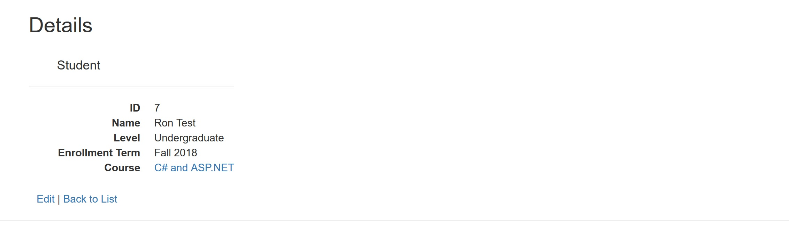

# Lab-13-Student-Enrollment
- CODE: Student Enrollment assignment for Code Fellows 401 C#/.NET course
- Website Link: http://studentenrollment20180626022941.azurewebsites.net/

**Author**: Earl Jay Caoile  
**Version**: 1.0.0

## Overview
This MVC web application allows users to look at a list of courses and students.
Courses can be created, and students can be added to these courses. Courses cannot
be deleted if students are currently in them.

## Getting Started
The following is required to run the program.
1. Visual Studio 2017 
2. The .NET desktop development workload enabled
3. ASP.NET web API packages

## Example
  
  
  
  
  

## Happy path
- open home page
- click students page button
- view studets and perform CRUD operations (create, edit, view details, delete)
- click button to return to home page
- click courses page button
- view courses and perform CRUD operations (create, edit, view details, delete)
- smile

## Architecture
This application is created using ASP.NET Core 2.1 Web Application  
*Languages*: C#, HTML, CSS  
*Type of Applicaiton*: Web Application  

## Change Log
06-20-2018 10:30 AM - initial scaffolding  
06-21-2018 11:00 AM - got a website of sorts running 
06-22-2018 11:00 AM - got CRUD working for students 
06-23-2018 3:00 PM - got styling working for students 
06-24-2018 1:00 PM - got scaffolding for courses 
06-25-2018 10:00 AM - refactoring student class to take in course ID instead of enum 
06-25-2018 2:00 PM - added styling to courses 
06-25-2018 10:00 PM - detail view for students, CRUD working on courses 
06-26-2018 11:00 AM - code optimizations and proper CRUD for both students and courses 
06-26-2018 3:00 PM - tests created 
06-26-2018 5:00 PM - deployed to Azure 
06-26-2018 10:00 PM - more code optimizations, preventing course from being deleted if it has students 
06-26-2018 11:00 PM - finished readme 

